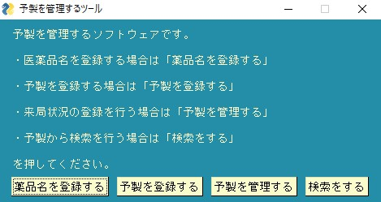
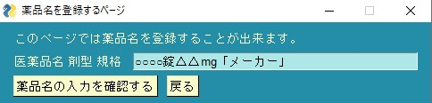
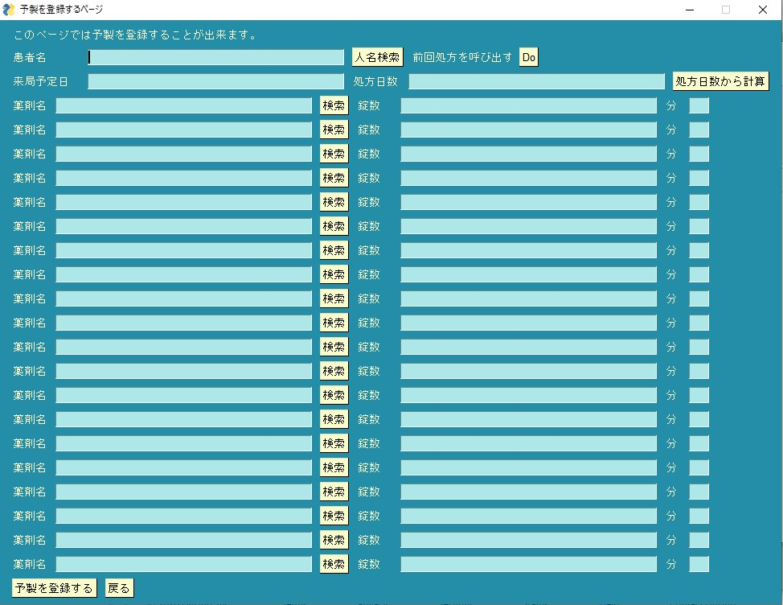
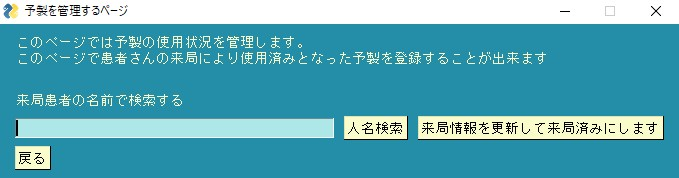
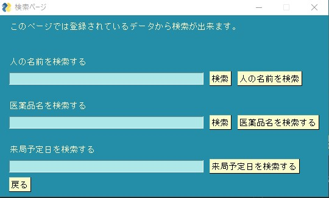

# 予製を管理するアプリ
   
## そもそもどんなアプリなの？
予製を登録する事で  
・誰の予製に  
・何という薬剤が  
・何錠入っているのか    
入っていいるのかを簡単に管理出来るようにすることを目指したアプリ
### 使い方
#### メインメニュー
  
　
  
  
基本的にアプリケーションの中で詳しく解説しているので、ここでは細かい仕様について解説します。  
薬品名を登録するでは薬品名を登録する事が出来ます。  
ここで登録した薬品名は後々入力補完用のデータとして使われます。  
現状最新バージョンでは半角全角を区別して検索します。  
登録前に半角で登録するのか全角で登録するのかを決めてから登録する事をお勧めします  
　
  
  
　
  
ひな形が用意されていますがこの通りに入力する必要はありません。  
各施設ごとに必要十分な情報を入力していただければ問題ありません。  
重複登録はできないようになっています。  
ただし前述のとおり半角全角を区別しない為  
「ﾔｸﾋﾝﾒｲ」と「ヤクヒンメイ」  
は別物として認識されます注意してください。
  
　  
　  

　  
　  
人名検索ボタンでは左側の入力欄が空欄の場合過去に登録された人名全てを入力補完出来るようになっています  
もちろん一文字以上の入力があった場合は入力内容に従った検索結果が提示されます  
　  
一方で薬剤名の検索は一文字以上の入力がない限り検索は出来ない仕様になっています。  
前述の薬品名を登録するで登録された薬品名が入力補完されるようになっています。  
Doボタンは前回入力内容が復元されます  
処方日数から計算ボタンは分○○のデータと処方日数を元に計算を行います  
計算結果は自動で錠数に組み込まれます。  
重複登録は許可されていません。  
同一人物で2つの予製を登録する場合〇〇〇〇(△△△△科)など人名部分で調節してください。  
ここでいう重複登録はその人名の未使用の予製データが残っている場合の新規登録を指します。
　  
　  
  
　  
　  
ここでは来局情報を更新できます。  
予製を使用した後ここで使用状態を変更し新しい予製を登録出来るようにできます。  
ここで使用状態が変更されると検索欄にて薬剤検索をした時検索結果に引っかからなくなります。
　  
　  
  
　  
　  
このページは検索画面です。  
各種検索を行うことが出来ます。

## ライセンスと開発者について
ライセンスは記載のとおりMITライセンスです。  
バグの修正や追加してほしい機能についてはGitHubの機能を用いた連絡のほかに  
メールアドレス hello @ ksrm .me (空白は抜いてください)  
に送って頂ければ可能な範囲内で対応させていただきます。